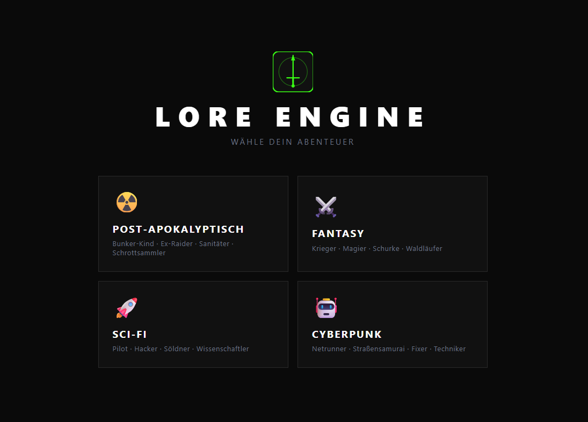

# ⚔️ Lore Engine

An AI-powered RPG with dynamic storytelling across 4 unique settings, powered by OpenRouter. Supports local multiplayer for up to 4 players.

## 🌍 Live Demo
👉 [lore-engine.netlify.app](https://lore-engine.netlify.app)

## 📸 Screenshot


## ✨ Features
- 🌍 4 unique settings (Post-Apocalyptic, Fantasy, Sci-Fi, Cyberpunk)
- 👥 Local multiplayer (up to 4 players, shared story with rotating turns)
- 🧙 Character creation with attributes, classes and perks
- 📖 AI-generated dynamic storytelling (OpenRouter, model auto-routing)
- ⚔️ Turn-based combat system with D20/D6 dice mechanics
- 🎲 Animated dice rolls with advantage system per class
- 🛡️ Shield system per character class
- 🎒 Inventory system with usable items (heal, shield, weapons)
- ⬆️ Level-Up system with XP
- 💀 Game Over screen with fade-in animation, sound and run summary
- 🔄 "New Game" reset without needing devtools
- 💾 Auto-save via localStorage
- 🎨 Setting-specific color themes and UI

## 🚀 Roadmap
- [ ] 🏆 Achievements system (First Victory, Level 5, 100 Caps...)
- [ ] 🎵 Background music per setting
- [ ] 📊 Statistics screen (fights won, total XP, etc. — tracking already in place)
- [ ] 🛠️ Item crafting/combination system

## 🛠️ Tech Stack
- React + Vite
- Tailwind CSS v4
- OpenRouter API (AI Narrator, auto-routing)
- localStorage (Save System)
- Netlify (Deployment)

## 🚀 Getting Started

```bash
npm install
npm run dev
```

## 🔑 Environment Variables
Create a `.env.local` file:

```
VITE_GEMINI_API_KEY=your_api_key_here

```


## 🐛 Known Issues & Lessons Learned

### 🔄 API Rate Limits
- **Problem:** Google Gemini Free Tier hatte strenge Rate Limits die das Entwickeln stark behindert haben
- **Lösung:** Wechsel zu OpenRouter mit Auto-Routing für stabilere Verfügbarkeit
- **Lerneffekt:** Immer einen Fallback-Plan für externe APIs einplanen

### 📖 Story-Persistenz nach Inventar
- **Problem:** Nach dem Öffnen des Inventars wurde die Story neu geladen und erzählte eine andere Geschichte
- **Lösung:** Story-State im gameState gespeichert + Loading-State nur auf `true` wenn noch keine Story vorhanden
- **Lerneffekt:** React-Komponenten verlieren lokalen State beim Unmounten — wichtige Daten gehören in den globalen State

### 💾 localStorage undefined Bug
- **Problem:** `undefined` wurde in localStorage gespeichert und verursachte beim Laden Fehler
- **Lösung:** Null-Checks beim Lesen und Schreiben eingebaut
- **Lerneffekt:** Immer defensive Programmierung bei externem Storage betreiben

### 🏁 Stale-Closure Race Condition im Mehrspieler-State
- **Problem:** Beim Übergang zwischen Kampf und Story konnte die Spieler-Rotation ungewollt einen zusätzlichen Schritt weiterspringen — reproduzierbar, aber schwer zu fassen
- **Ursache:** Der zentrale `updateState`-Merge (`{...safeState, ...updates}`) nutzte einen pro Render eingefrorenen State-Schnappschuss. Zwei zeitversetzte `onUpdateState`-Aufrufe innerhalb derselben Funktion griffen auf denselben veralteten Schnappschuss zurück — der zweite Aufruf hat dadurch ein bereits gelöschtes Feld (`lastCombatResult`) versehentlich wiederhergestellt
- **Lösung:** Betroffenes Feld im finalen Update-Aufruf explizit auf `null` gesetzt, zusätzlich ein `useRef`-Guard gegen doppelte Effect-Ausführung durch React StrictMode
- **Lerneffekt:** Bei mehreren zeitversetzten State-Updates in derselben Closure genau prüfen, welcher State-Schnappschuss tatsächlich verwendet wird — insbesondere bei async Code

## 📬 Contact

- **GitHub:** [@VampireNoob](https://github.com/VampireNoob)
- **Instagram:** [@vampirenoob](https://www.instagram.com/vampirenoob)