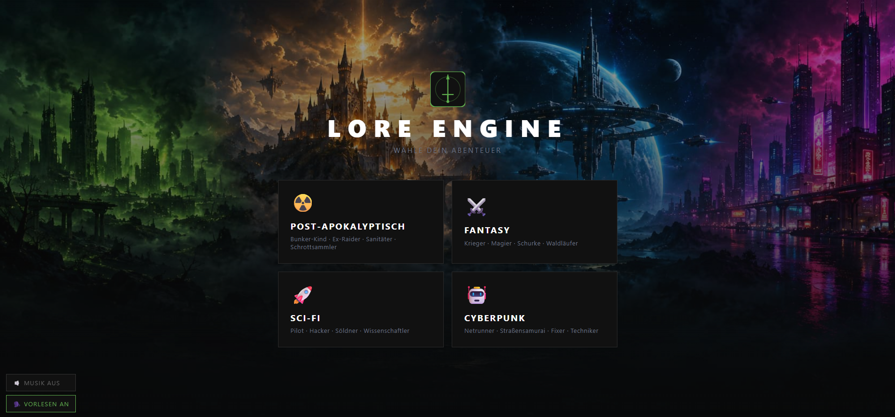

# ⚔️ Lore Engine

An AI-powered RPG with dynamic storytelling across 4 unique settings, powered by OpenRouter. Supports local multiplayer for up to 4 players.

## 🌍 Live Demo
👉 [lore-engine.netlify.app](https://lore-engine.netlify.app)

## 📸 Screenshot


## ✨ Features
- 🌍 4 unique settings (Post-Apocalyptic, Fantasy, Sci-Fi, Cyberpunk)
- 👥 Local multiplayer (up to 4 players, shared story with rotating turns)
- 🧙 Character creation with attributes and classes
- 📖 AI-generated dynamic storytelling (OpenRouter, free-model routing)
- 🗣️ Automatic narration of the story via the browser's Web Speech API
- ⚔️ Turn-based combat system with D20/D6 dice mechanics
- 🎲 Real 3D dice (D6 and D20) built with three.js, with an advantage system per class
- 🛡️ Shield system per character class
- 🎒 Inventory with usable items (heal, shield, weapon-specific attack bonuses)
- 🔫 Ammo system: ranged weapons consume ammo, melee weapons don't
- 🛠️ Item crafting: combine materials by category to create gear
- ⬆️ Level-Up system with XP
- 💀 Game Over screen with fade-in animation, sound and run summary
- 📊 Statistics screen (fights won, total XP, total currency, group overview)
- 🏆 Achievements system (10 achievements, persists independently of save resets)
- 🎵 Procedural ambient music per setting (Web Audio API, no audio files) with volume control and automatic ducking during narration
- 🔄 "New Game" reset without needing devtools
- 💾 Auto-save via localStorage
- 🎨 Setting-specific color themes and UI

## 🚀 Roadmap
- [ ] 🌆 3D background scenes per setting
- [ ] 🧑 3D character models per class
- [ ] 💊 Parse item effects from descriptions (with caps) and timed attribute buffs
- [ ] 🗣️ Higher-quality narration voice

## 🛠️ Tech Stack
- React + Vite
- Tailwind CSS v4
- three.js + @react-three/fiber (3D dice)
- OpenRouter API (AI narrator, free-model router)
- Web Audio API (sound effects and ambient music)
- Web Speech API (narration)
- localStorage (save system, separate persistence for achievements)
- Netlify (deployment)

## 📁 Structure

```
├── public/
├── src/
│   ├── components/
│   │   ├── AchievementToast.jsx
│   │   ├── Dice3D.jsx
│   │   └── SettingSelect.jsx
│   ├── hooks/
│   │   ├── useAchievements.js
│   │   ├── useAmbientMusic.js
│   │   ├── useCombat.js
│   │   ├── useGameState.js
│   │   ├── useLevelUp.js
│   │   ├── useLocalStorage.js
│   │   └── useTextToSpeech.js
│   ├── screens/
│   │   ├── CharCreate.jsx
│   │   ├── Combat.jsx
│   │   ├── GameOver.jsx
│   │   ├── Inventory.jsx
│   │   ├── PlayerCountSelect.jsx
│   │   ├── Statistics.jsx
│   │   └── Story.jsx
│   ├── settings/
│   │   ├── cyberpunk.js
│   │   ├── fantasy.js
│   │   ├── index.js
│   │   ├── postApoc.js
│   │   └── scifi.js
│   ├── App.jsx
│   ├── index.css
│   └── main.jsx
├── .env.local
├── .gitignore
├── eslint.config.js
├── index.html
├── package.json
└── README.md
```

## 🚀 Getting Started

```bash
npm install
npm run dev
```

## 🔑 Environment Variables
Create a `.env.local` file:

```
VITE_OPENROUTER_API_KEY=your_api_key_here
```

## 🐛 Known Issues & Lessons Learned

### 🔄 API Rate Limits
- **Problem:** Google Gemini's free tier had strict rate limits that significantly slowed down development
- **Solution:** Switched to OpenRouter
- **Takeaway:** Always plan a fallback for external APIs

### 💸 Free vs. Auto Model Routing
- **Problem:** `openrouter/auto` picks the best model, including paid ones, which caused HTTP 402 errors once the credit balance ran out. Pinning a single `:free` model failed too, because individual free models get removed without notice (HTTP 404)
- **Solution:** Use `openrouter/free`, a router that only selects among currently available free models
- **Takeaway:** "Automatic" does not mean "free" — read what a routing option actually guarantees

### 📖 Story Persistence After Opening Inventory
- **Problem:** Opening the inventory caused the story to reload and tell a different story
- **Solution:** Story state saved in gameState + loading state only set to `true` when no story exists yet
- **Takeaway:** React components lose local state on unmount — important data belongs in global state

### 💾 localStorage undefined Bug
- **Problem:** `undefined` was being saved to localStorage and caused errors on load
- **Solution:** Added null checks when reading and writing
- **Takeaway:** Always use defensive programming with external storage

### 🏁 Stale Closure Race Condition in Multiplayer State
- **Problem:** During the transition between combat and story, player rotation could unexpectedly skip an extra step forward — reproducible, but hard to pin down
- **Cause:** The central `updateState` merge (`{...safeState, ...updates}`) used a state snapshot frozen per render. Two time-delayed `onUpdateState` calls within the same function referenced the same stale snapshot — the second call unintentionally restored an already-cleared field (`lastCombatResult`)
- **Solution:** Explicitly set the affected field to `null` in the final update call, plus a `useRef` guard against duplicate effect execution caused by React StrictMode
- **Takeaway:** With multiple time-delayed state updates in the same closure, carefully check which state snapshot is actually being used, especially with async code

### 🔊 Browser Autoplay Policy
- **Problem:** Sounds and music via the Web Audio API don't start automatically unless triggered by a direct user interaction (e.g. on page reload)
- **Solution:** Music is deliberately started via an explicit toggle button instead of automatically on load
- **Takeaway:** Modern browsers consistently block audio autoplay, so design for a UI interaction as the trigger

### 🎲 Mapping Dice Faces to Results in 3D
- **Problem:** A 3D die must always land showing the number that was actually rolled
- **Solution:** The result is decided by the game logic first; the die then rotates towards a precomputed target orientation for that number (per-face basis for the D20, fixed rotations for the D6)
- **Takeaway:** Keep game logic and presentation separate. The 3D scene only displays an outcome, it never decides it

## 📬 Contact

- **GitHub:** [@VampireNoob](https://github.com/VampireNoob)
- **Instagram:** [@vampirenoob](https://www.instagram.com/vampirenoob)